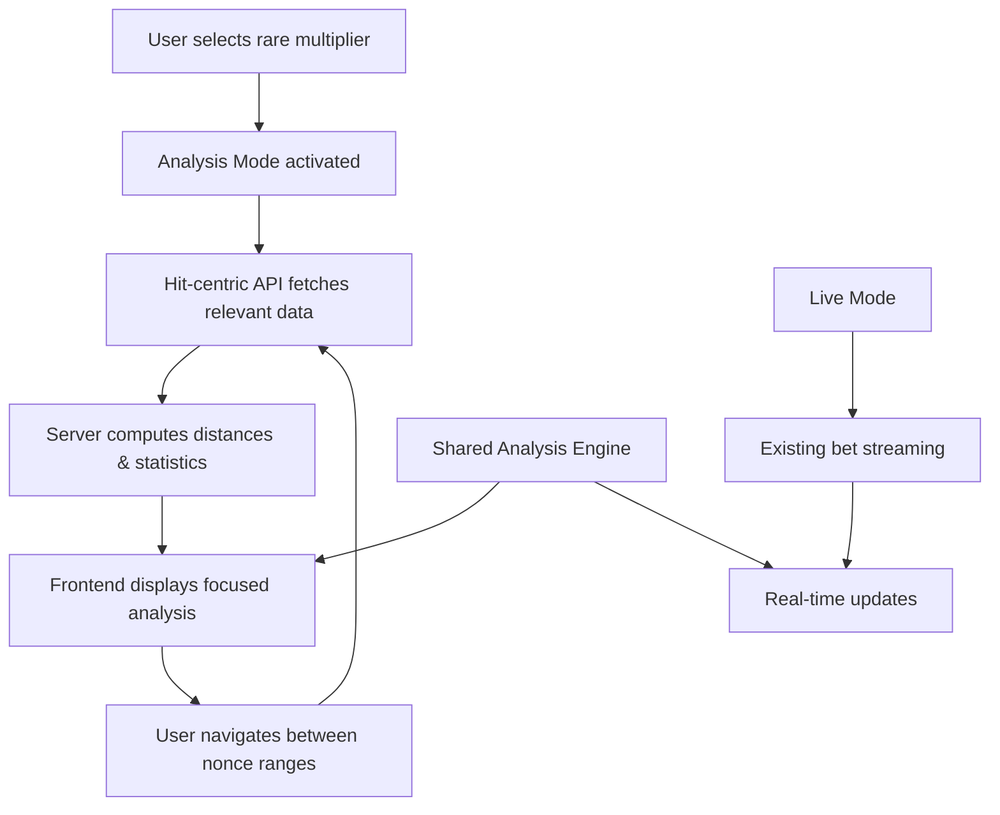

# Design Document

## Overview

The Hit-Centric Analysis Pipeline transforms the current bet-streaming approach into an efficient system for analyzing ultra-rare multipliers across large nonce ranges (70k+). Instead of streaming all bets and filtering client-side, the system fetches only relevant hits with proper distance calculations, enabling deep historical analysis without performance constraints.

The design introduces new API endpoints, database optimizations, and frontend components that work together to provide instant access to rare multiplier patterns while maintaining the existing live streaming functionality.

## Architecture

### High-Level Flow



### System Components

1. **Hit-Centric API Layer** - New endpoints for fetching specific multiplier occurrences
2. **Database Optimizations** - Generated columns and indexes for efficient hit queries
3. **Analysis Engine** - Shared calculation logic for consistent statistics
4. **Range Navigator** - UI for jumping between nonce windows
5. **Unified Context Provider** - Single source of truth for analysis data

## Components and Interfaces

### Backend API Endpoints

#### 1. Hit Query Endpoint
```typescript
GET /live/streams/{stream_id}/hits
Query Parameters:
- bucket: number (e.g., 11200 for 11,200×)
- after_nonce?: number (default: 0)
- before_nonce?: number (default: current max)
- limit?: number (default: 500, max: 1000)
- order?: "nonce_asc" | "nonce_desc" (default: "nonce_asc")
- include_distance?: boolean (default: true)

Response:
{
  hits: Array<{
    nonce: number,
    bucket: number,
    distance_prev: number | null,
    id: number,
    date_time: string | null
  }>,
  prev_nonce_before_range: number | null,
  total_in_range: number,
  has_more: boolean
}
```

#### 2. Hit Statistics Endpoints

**Per-Range Statistics**
```typescript
GET /live/streams/{stream_id}/hits/stats
Query Parameters:
- bucket: number
- ranges?: string (e.g., "0-20000,20000-40000,40000-70000")

Response:
{
  stats_by_range: Array<{
    range: string,
    count: number,
    median: number | null,
    mean: number | null,
    min: number | null,
    max: number | null,
    method: "exact" | "approximate"
  }>
}
```

**Global Statistics**
```typescript
GET /live/streams/{stream_id}/hits/stats/global
Query Parameters:
- bucket: number

Response:
{
  global_stats: {
    count: number,
    median: number | null,
    mean: number | null,
    theoretical_eta: number | null,
    confidence_interval: [number, number] | null,
    method: "exact" | "approximate"
  }
}
```

#### 3. Batch Hit Query Endpoint
```typescript
GET /live/streams/{stream_id}/hits/batch
Query Parameters:
- buckets: string (comma-separated, e.g., "11200,48800")
- after_nonce?: number
- before_nonce?: number
- limit_per_bucket?: number

Response:
{
  hits_by_bucket: Record<string, Array<HitRecord>>,
  stats_by_bucket: Record<string, StatsSummary>
}
```

### Database Schema Changes

#### 1. Generated Bucket Column
```sql
-- Add generated column for consistent bucketing
ALTER TABLE live_bets 
ADD COLUMN bucket_2dp DECIMAL(10,2) 
GENERATED ALWAYS AS (ROUND(round_result, 2)) STORED;

-- Create composite index for efficient hit queries
CREATE INDEX idx_live_bets_hit_analysis 
ON live_bets (stream_id, bucket_2dp, nonce);

-- Create index for range queries
CREATE INDEX idx_live_bets_nonce_range 
ON live_bets (stream_id, nonce, bucket_2dp);
```

#### 2. Hit Statistics Rollup Table (Optional)
```sql
-- For approximate statistics on massive datasets
-- Rollups are generated on-demand and cached for subsequent queries
CREATE TABLE hit_rollups (
    id SERIAL PRIMARY KEY,
    stream_id UUID NOT NULL,
    bucket_2dp DECIMAL(10,2) NOT NULL,
    nonce_range_start INTEGER NOT NULL,
    nonce_range_end INTEGER NOT NULL,
    hit_count INTEGER NOT NULL,
    distance_digest BYTEA, -- t-digest for approximate quantiles
    created_at TIMESTAMP DEFAULT NOW(),
    expires_at TIMESTAMP DEFAULT (NOW() + INTERVAL '1 hour'), -- Cache expiration
    FOREIGN KEY (stream_id) REFERENCES live_streams(id) ON DELETE CASCADE
);

CREATE INDEX idx_hit_rollups_lookup 
ON hit_rollups (stream_id, bucket_2dp, nonce_range_start, nonce_range_end);

CREATE INDEX idx_hit_rollups_expiry 
ON hit_rollups (expires_at) WHERE expires_at IS NOT NULL;
```

### Frontend Architecture

#### 1. Analysis Context Provider
```typescript
interface AnalysisContextValue {
  mode: 'live' | 'analysis';
  streamId: string;
  focusedBucket: number | null;
  currentRange: [number, number];
  minMultiplier: number;
  
  // Data
  hits: HitRecord[];
  distanceById: Map<string | number, number | null>;
  statsByBucket: Record<string, BucketStats>;
  statsByPinnedBuckets: Record<string, BucketStats>; // Pre-computed for all pinned buckets
  scopeLabel: string; // Current scope description
  
  // Actions
  setFocusedBucket: (bucket: number | null) => void;
  setCurrentRange: (range: [number, number]) => void;
  setMinMultiplier: (min: number) => void;
  jumpToRange: (startNonce: number) => void;
}

export const AnalysisProvider: React.FC<{
  streamId: string;
  children: React.ReactNode;
}> = ({ streamId, children }) => {
  // Implementation using React Query and shared state
};
```

#### 2. Hit-Centric Data Hooks
```typescript
// Hook for fetching hits in current range
export function useHits(options: {
  streamId: string;
  bucket: number;
  range: [number, number];
  enabled?: boolean;
}) {
  return useQuery({
    queryKey: ['hits', options.streamId, options.bucket, options.range],
    queryFn: () => fetchHits(options),
    staleTime: 5 * 60 * 1000, // 5 minutes
    gcTime: 10 * 60 * 1000, // 10 minutes
  });
}

// Hook for hit statistics
export function useHitStats(options: {
  streamId: string;
  bucket: number;
  ranges?: string[];
  global?: boolean;
}) {
  return useQuery({
    queryKey: ['hitStats', options.streamId, options.bucket, options.ranges, options.global],
    queryFn: () => fetchHitStats(options),
    staleTime: 2 * 60 * 1000, // 2 minutes
  });
}
```

#### 3. Range Navigator Component
```typescript
interface RangeNavigatorProps {
  currentRange: [number, number];
  maxNonce: number;
  onRangeChange: (range: [number, number]) => void;
  rangeSize?: number; // default 10000
}

export const RangeNavigator: React.FC<RangeNavigatorProps> = ({
  currentRange,
  maxNonce,
  onRangeChange,
  rangeSize = 10000
}) => {
  // Implementation with prev/next buttons and jump-to input
};
```

#### 4. Sticky Analysis Bar Component
```typescript
interface AnalysisBarProps {
  mode: 'live' | 'analysis';
  onModeChange: (mode: 'live' | 'analysis') => void;
  focusedBucket: number | null;
  currentRange: [number, number];
  stats: BucketStats | null;
  pinnedBuckets: number[];
  statsByPinnedBuckets: Record<string, BucketStats>; // Pre-computed stats for all pinned buckets
  onPinnedBucketsChange: (buckets: number[]) => void;
  scopeLabel: string; // e.g. "43 hits • nonce 60k–70k • bucket 11.2kx"
}

export const AnalysisBar: React.FC<AnalysisBarProps> = (props) => {
  // Sticky bar with mode toggle, range controls, live stats, and scope indicator
};
```

## Data Models

### Core Data Types

```typescript
interface HitRecord {
  id: number;
  nonce: number;
  bucket: number;
  distance_prev: number | null;
  date_time: string | null;
}

interface BucketStats {
  count: number;
  median: number | null;
  mean: number | null;
  min: number | null;
  max: number | null;
  method: 'exact' | 'approximate';
}

interface RangeStats {
  range: string;
  stats: BucketStats;
}

interface GlobalStats extends BucketStats {
  theoretical_eta: number | null;
  confidence_interval: [number, number] | null;
}
```

### Analysis Engine Interface

```typescript
interface AnalysisEngine {
  // Core calculations
  computeDistancesNonceAsc(hits: HitRecord[]): Map<number, number | null>;
  bucketMultiplier(multiplier: number): number;
  
  // Statistics
  calculateBucketStats(
    hits: HitRecord[], 
    distanceById: Map<number, number | null>
  ): BucketStats;
  
  // Range operations
  filterHitsByRange(
    hits: HitRecord[], 
    range: [number, number]
  ): HitRecord[];
  
  // Validation
  validateDistanceConsistency(
    hits: HitRecord[], 
    distanceById: Map<number, number | null>
  ): boolean;
}
```

## Error Handling

### API Error Responses

```typescript
interface ApiError {
  status: number;
  code: string;
  message: string;
  details?: Record<string, any>;
}

// Common error scenarios
const ErrorCodes = {
  STREAM_NOT_FOUND: 'STREAM_NOT_FOUND',
  INVALID_BUCKET: 'INVALID_BUCKET',
  INVALID_RANGE: 'INVALID_RANGE',
  RANGE_TOO_LARGE: 'RANGE_TOO_LARGE',
  DATABASE_ERROR: 'DATABASE_ERROR',
  RATE_LIMITED: 'RATE_LIMITED'
} as const;
```

### Frontend Error Handling

```typescript
// Error boundary for analysis components
export class AnalysisErrorBoundary extends React.Component {
  // Handle analysis-specific errors gracefully
}

// Query error handling
const useHitsWithErrorHandling = (options: UseHitsOptions) => {
  const query = useHits(options);
  
  const errorMessage = useMemo(() => {
    if (!query.error) return null;
    
    const apiError = query.error as ApiError;
    switch (apiError.code) {
      case 'RANGE_TOO_LARGE':
        return 'Range too large. Try a smaller nonce window.';
      case 'INVALID_BUCKET':
        return 'Invalid multiplier value.';
      default:
        return 'Failed to load hit data. Please try again.';
    }
  }, [query.error]);
  
  return { ...query, errorMessage };
};
```

## Testing Strategy

### Unit Tests

1. **Analysis Engine Tests**
   ```typescript
   describe('AnalysisEngine', () => {
     test('computeDistancesNonceAsc handles range boundaries correctly', () => {
       // Test distance calculation across range boundaries
     });
     
     test('bucketMultiplier normalizes to 2 decimal places', () => {
       expect(bucketMultiplier(11200.0000001)).toBe(11200.00);
     });
     
     test('calculateBucketStats returns accurate statistics', () => {
       // Test median, mean, min, max calculations
     });
   });
   ```

2. **API Endpoint Tests**
   ```typescript
   describe('Hit API Endpoints', () => {
     test('GET /hits returns correct hits for bucket and range', async () => {
       // Test hit filtering and pagination
     });
     
     test('GET /hits/stats computes accurate statistics', async () => {
       // Test statistical calculations
     });
     
     test('handles range boundary edge cases', async () => {
       // Test first hit in range has correct distance
     });
   });
   ```

### Integration Tests

1. **End-to-End Analysis Workflow**
   ```typescript
   describe('Hit-Centric Analysis', () => {
     test('user can analyze rare multiplier across 70k nonces', async () => {
       // 1. Set analysis mode
       // 2. Select 11,200× multiplier
       // 3. Navigate through multiple ranges
       // 4. Verify statistics consistency
       // 5. Check performance metrics
     });
     
     test('statistics remain consistent between components', async () => {
       // Verify chips, table, and summary show same numbers
     });
   });
   ```

2. **Performance Tests**
   ```typescript
   describe('Performance', () => {
     test('70k nonce analysis completes within 2 seconds', async () => {
       // Test query performance with large datasets
     });
     
     test('range navigation is instant with caching', async () => {
       // Test React Query cache effectiveness
     });
   });
   ```

### Database Performance Tests

```sql
-- Test hit query performance
EXPLAIN ANALYZE 
SELECT nonce, bucket_2dp, 
       nonce - LAG(nonce) OVER (PARTITION BY bucket_2dp ORDER BY nonce) as distance
FROM live_bets 
WHERE stream_id = $1 AND bucket_2dp = $2 AND nonce BETWEEN $3 AND $4
ORDER BY nonce;

-- Test statistics query performance
EXPLAIN ANALYZE
SELECT COUNT(*) as count,
       percentile_cont(0.5) WITHIN GROUP (ORDER BY distance) as median,
       AVG(distance)::int as mean,
       MIN(distance) as min,
       MAX(distance) as max
FROM (
  SELECT nonce - LAG(nonce) OVER (PARTITION BY bucket_2dp ORDER BY nonce) as distance
  FROM live_bets 
  WHERE stream_id = $1 AND bucket_2dp = $2 AND nonce BETWEEN $3 AND $4
) distances
WHERE distance IS NOT NULL;
```

## Implementation Phases

### Phase 1: Database & API Foundation
1. Add `bucket_2dp` generated column and indexes
2. Implement `/hits` and `/hits/stats` endpoints
3. Add comprehensive API tests
4. Performance testing with large datasets

### Phase 2: Frontend Analysis Engine
1. Create shared `analysisMath.ts` engine
2. Implement `AnalysisProvider` context
3. Build `useHits` and `useHitStats` hooks
4. Unit tests for calculation consistency

### Phase 3: UI Components
1. Build `RangeNavigator` component
2. Create `AnalysisBar` with mode toggle
3. Implement pinned multiplier chips
4. Add keyboard shortcuts and accessibility

### Phase 4: Integration & Optimization
1. Integrate with existing table component
2. Add React Query caching optimizations
3. Implement Web Worker for large calculations
4. End-to-end testing and performance tuning

### Phase 5: Advanced Features (Optional)
1. Implement on-demand t-digest rollups with 1-hour cache expiration
2. Add pattern detection algorithms for unusual clustering
3. Build comparison modes between different ranges
4. Export functionality for analysis results

## Performance Considerations

### Database Optimizations
- Generated `bucket_2dp` column eliminates runtime rounding
- Composite indexes enable efficient range + bucket queries
- Window functions compute distances server-side
- Optional rollup tables for approximate statistics at scale

### Frontend Optimizations
- React Query caching keeps recently accessed ranges hot
- Web Workers for large distance calculations
- Virtualized table for smooth scrolling with 10k+ hits
- Debounced range navigation to prevent excessive API calls

### Memory Management
- LRU cache eviction for old ranges
- Compressed API responses with gzip
- Minimal data transfer (only hit essentials)
- Shared calculation engine prevents duplication

## Security Considerations

### API Security
- Existing ingest token authentication applies to new endpoints
- Rate limiting on hit queries to prevent abuse
- Input validation for bucket values and ranges
- SQL injection prevention with parameterized queries

### Data Privacy
- No additional PII exposure (same data as existing endpoints)
- Range-based access maintains existing stream isolation
- Audit logging for analysis queries (optional)

## Monitoring and Observability

### Performance Metrics
- Hit query response times by range size
- Cache hit rates for React Query
- Database query execution plans
- Memory usage during large calculations

### Business Metrics
- Most analyzed multiplier buckets
- Average range sizes accessed
- Analysis session durations
- Error rates by endpoint

### Alerting
- Slow query alerts (>2s for hit queries)
- High error rates on analysis endpoints
- Memory usage spikes during calculations
- Cache miss rate degradation    