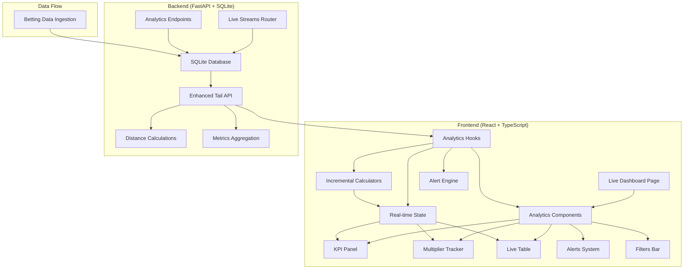

# Design Document

## Overview

The Live Analytics Dashboard transforms the existing live streams functionality into a comprehensive real-time analytics platform. The design builds upon the current FastAPI backend and React frontend architecture, adding incremental calculations, live KPIs, multiplier tracking, alerts, and interactive features while maintaining the local-first, single-user design principles.

## Architecture

### High-Level Architecture



### Component Architecture

The dashboard follows a layered architecture:

1. **Presentation Layer**: React components for UI rendering
2. **State Management Layer**: Custom hooks with incremental calculations
3. **Data Layer**: Enhanced API client with real-time polling
4. **Backend Layer**: Extended FastAPI endpoints with optional server-side calculations

## Components and Interfaces

### Frontend Components

#### 1. LiveAnalyticsDashboard (Main Container)

```typescript
interface LiveAnalyticsDashboardProps {
  streamId: string;
}

interface DashboardState {
  // Live data
  bets: BetRecord[];
  lastId: number;
  
  // KPI state
  kpis: LiveKPIs;
  
  // Pinned multipliers
  pinnedMultipliers: PinnedMultiplier[];
  
  // Filters
  filters: DashboardFilters;
  
  // UI state
  isPolling: boolean;
  freezeUI: boolean;
  pollInterval: number;
}
```

#### 2. LiveKPIPanel

```typescript
interface LiveKPIs {
  highestMultiplier: number;
  hitsCount: number;
  hitRate: number; // hits/min
  hitRateEMA: number; // 30s EMA
  latestNonce: number;
  latestGap: number; // nonce gap since last row
  lastHitDistance: number; // nonce gap since last hit
}

interface LiveKPIPanelProps {
  kpis: LiveKPIs;
  isLive: boolean;
  streamStartTime: Date;
}
```

#### 3. MultiplierTracker

```typescript
interface PinnedMultiplier {
  multiplier: number;
  tolerance: number; // 1e-9
  stats: MultiplierStats;
  alerts: AlertRule[];
}

interface MultiplierStats {
  count: number;
  lastNonce: number;
  lastGap: number;
  meanGap: number;
  stdGap: number;
  maxGap: number;
  p90Gap: number;
  ringBuffer: number[]; // last 50 gaps
  eta: {
    value: number;
    model: 'theoretical' | 'observed';
  };
}

interface MultiplierTrackerProps {
  pinnedMultipliers: PinnedMultiplier[];
  onPin: (multiplier: number) => void;
  onUnpin: (multiplier: number) => void;
  onShowDistances: (multiplier: number) => void;
}
```

#### 4. LiveTable

```typescript
interface LiveTableProps {
  bets: BetRecord[];
  filters: DashboardFilters;
  onBookmark: (bet: BetRecord, note?: string) => void;
  distanceColumn: boolean;
  highlightMultiplier?: number;
}

interface EnhancedBetRecord extends BetRecord {
  distance_prev_opt?: number; // from server or client calculation
  isBookmarked?: boolean;
  alertTriggered?: boolean;
}
```

#### 5. AlertsPanel

```typescript
interface AlertRule {
  id: string;
  multiplier: number;
  type: 'gap' | 'cluster' | 'threshold';
  config: GapAlertConfig | ClusterAlertConfig | ThresholdAlertConfig;
  enabled: boolean;
}

interface GapAlertConfig {
  threshold: 'p95' | 'mean_plus_z';
  zScore?: number; // for mean_plus_z
}

interface ClusterAlertConfig {
  windowNonces: number; // default 2000
  windowSeconds: number; // default 60
  minCount: number; // default 3
  minMultiplier: number;
}

interface ThresholdAlertConfig {
  targetMultiplier: number;
}

interface AlertsPanelProps {
  alerts: AlertRule[];
  recentAlerts: AlertEvent[];
  onConfigureAlert: (rule: AlertRule) => void;
}
```

#### 6. DensitySparkline

```typescript
interface DensityData {
  buckets: Map<number, number>; // bucket_id -> count
  bucketSize: number; // 1000 or 5000
  maxCount: number;
}

interface DensitySparklineProps {
  data: DensityData;
  width: number;
  height: number;
}
```

### Backend Enhancements

#### 1. Enhanced Tail Endpoint

```python
@router.get("/streams/{stream_id}/tail", response_model=EnhancedTailResponse)
async def tail_stream_bets(
    stream_id: UUID,
    since_id: int,
    include_distance: bool = False,
    session: AsyncSession = Depends(get_session)
) -> EnhancedTailResponse:
    """Enhanced tail endpoint with optional distance calculations."""
```

```python
class EnhancedTailResponse(BaseModel):
    bets: List[EnhancedBetRecord] = Field(..., description="New bet records")
    last_id: Optional[int] = Field(None, description="Highest ID for next poll")
    has_more: bool = Field(..., description="Whether more records available")
    metrics: Optional[TailMetrics] = Field(None, description="Pre-computed metrics")

class EnhancedBetRecord(BetRecord):
    distance_prev_opt: Optional[int] = Field(None, description="Distance to previous same-multiplier hit")

class TailMetrics(BaseModel):
    total_new_bets: int
    highest_multiplier_in_batch: Optional[float]
    multiplier_counts: Dict[str, int] # stringified multiplier -> count
```

#### 2. Analytics Endpoints

```python
@router.get("/streams/{stream_id}/analytics/multipliers", response_model=MultiplierAnalytics)
async def get_multiplier_analytics(
    stream_id: UUID,
    multipliers: List[float] = Query(...),
    tolerance: float = Query(1e-9),
    session: AsyncSession = Depends(get_session)
) -> MultiplierAnalytics:
    """Get analytics for specific multipliers."""

class MultiplierAnalytics(BaseModel):
    stream_id: UUID
    multipliers: List[MultiplierStats]
    theoretical_probabilities: Optional[Dict[str, float]] = None
```

#### 3. Bookmarks and Snapshots

```python
class Bookmark(SQLModel, table=True):
    __tablename__ = "live_bookmarks"
    
    id: Optional[int] = Field(default=None, primary_key=True)
    stream_id: UUID = Field(nullable=False)
    nonce: int = Field(nullable=False)
    multiplier: float = Field(nullable=False)
    note: Optional[str] = Field(default=None, nullable=True)
    created_at: datetime = Field(default_factory=datetime.utcnow, nullable=False)

class Snapshot(SQLModel, table=True):
    __tablename__ = "live_snapshots"
    
    id: Optional[int] = Field(default=None, primary_key=True)
    stream_id: UUID = Field(nullable=False)
    name: str = Field(nullable=False)
    filter_state: str = Field(nullable=False)  # JSON serialized filters
    last_id_checkpoint: int = Field(nullable=False)
    created_at: datetime = Field(default_factory=datetime.utcnow, nullable=False)
```

### State Management

#### 1. Incremental Calculators

```typescript
class WelfordCalculator {
  private n = 0;
  private mean = 0;
  private m2 = 0;

  update(value: number): void {
    this.n += 1;
    const delta = value - this.mean;
    this.mean += delta / this.n;
    this.m2 += delta * (value - this.mean);
  }

  get stats() {
    return {
      count: this.n,
      mean: this.mean,
      variance: this.n > 1 ? this.m2 / (this.n - 1) : 0,
      stddev: this.n > 1 ? Math.sqrt(this.m2 / (this.n - 1)) : 0
    };
  }
}

class HistogramQuantileEstimator {
  private bins: number[] = new Array(64).fill(0);
  private binWidth: number;
  private minValue: number;
  private maxValue: number;

  constructor(minValue: number, maxValue: number) {
    this.minValue = minValue;
    this.maxValue = maxValue;
    this.binWidth = (maxValue - minValue) / 64;
  }

  update(value: number): void {
    const binIndex = Math.min(63, Math.floor((value - this.minValue) / this.binWidth));
    this.bins[binIndex]++;
  }

  getQuantile(q: number): number {
    const totalCount = this.bins.reduce((sum, count) => sum + count, 0);
    const targetCount = totalCount * q;
    
    let cumulativeCount = 0;
    for (let i = 0; i < this.bins.length; i++) {
      cumulativeCount += this.bins[i];
      if (cumulativeCount >= targetCount) {
        return this.minValue + (i + 0.5) * this.binWidth;
      }
    }
    return this.maxValue;
  }
}
```

#### 2. Analytics State Hook

```typescript
interface AnalyticsState {
  // Per-multiplier tracking
  multiplierStats: Map<number, MultiplierStatsCalculator>;
  
  // Density tracking
  densityBuckets: Map<number, number>;
  bucketSize: number;
  
  // KPI calculations
  kpiCalculator: KPICalculator;
  
  // Alert engine
  alertEngine: AlertEngine;
  
  // Rolling window stats
  rollingWindow: RollingWindowCalculator;
}

function useAnalyticsState(streamId: string): {
  state: AnalyticsState;
  updateFromTail: (newBets: BetRecord[]) => void;
  pinMultiplier: (multiplier: number) => void;
  unpinMultiplier: (multiplier: number) => void;
  configureAlert: (rule: AlertRule) => void;
} {
  // Implementation with incremental updates
}
```

## Data Models

### Enhanced API Types

```typescript
// Extended from existing BetRecord
interface EnhancedBetRecord extends BetRecord {
  distance_prev_opt?: number;
  bucket_id?: number;
  alert_triggered?: string[]; // alert rule IDs that fired
  is_bookmarked?: boolean;
}

// New analytics types
interface LiveKPIs {
  highest_multiplier: number;
  hits_count: number;
  hit_rate: number; // hits/min
  hit_rate_ema: number; // 30s EMA
  latest_nonce: number;
  latest_gap: number;
  last_hit_distance: number;
  stream_duration_seconds: number;
}

interface MultiplierStats {
  multiplier: number;
  tolerance: number;
  count: number;
  last_nonce: number;
  last_gap: number;
  mean_gap: number;
  std_gap: number;
  max_gap: number;
  p90_gap: number;
  p99_gap: number;
  eta_theoretical?: number;
  eta_observed: number;
  last_gaps: number[]; // ring buffer, max 50
}

interface DashboardFilters {
  min_multiplier?: number;
  order: 'nonce_asc' | 'id_desc';
  show_only_pinned: boolean;
  apply_filters_to_kpis: boolean;
}

interface AlertEvent {
  id: string;
  rule_id: string;
  multiplier: number;
  type: 'gap' | 'cluster' | 'threshold';
  message: string;
  nonce: number;
  timestamp: Date;
  acknowledged: boolean;
}
```

### Database Schema Extensions

```sql
-- Bookmarks table
CREATE TABLE live_bookmarks (
    id INTEGER PRIMARY KEY AUTOINCREMENT,
    stream_id TEXT NOT NULL,
    nonce INTEGER NOT NULL,
    multiplier REAL NOT NULL,
    note TEXT,
    created_at DATETIME NOT NULL DEFAULT CURRENT_TIMESTAMP,
    FOREIGN KEY (stream_id) REFERENCES live_streams(id) ON DELETE CASCADE
);

-- Snapshots table
CREATE TABLE live_snapshots (
    id INTEGER PRIMARY KEY AUTOINCREMENT,
    stream_id TEXT NOT NULL,
    name TEXT NOT NULL,
    filter_state TEXT NOT NULL, -- JSON
    last_id_checkpoint INTEGER NOT NULL,
    created_at DATETIME NOT NULL DEFAULT CURRENT_TIMESTAMP,
    FOREIGN KEY (stream_id) REFERENCES live_streams(id) ON DELETE CASCADE
);

-- Indexes for performance
CREATE INDEX idx_live_bookmarks_stream_nonce ON live_bookmarks(stream_id, nonce);
CREATE INDEX idx_live_snapshots_stream ON live_snapshots(stream_id);
```

## Error Handling

### Frontend Error Boundaries

```typescript
interface AnalyticsErrorBoundaryState {
  hasError: boolean;
  error?: Error;
  errorInfo?: ErrorInfo;
  retryCount: number;
}

class AnalyticsErrorBoundary extends Component<
  PropsWithChildren<{}>,
  AnalyticsErrorBoundaryState
> {
  // Handle calculation errors gracefully
  // Provide fallback UI
  // Allow retry with reset state
}
```

### Polling Error Handling

```typescript
interface PollingErrorStrategy {
  maxRetries: number;
  baseDelay: number;
  maxDelay: number;
  backoffMultiplier: number;
  
  shouldRetry(error: Error, attemptCount: number): boolean;
  getDelay(attemptCount: number): number;
}

const defaultPollingErrorStrategy: PollingErrorStrategy = {
  maxRetries: 5,
  baseDelay: 500,
  maxDelay: 5000,
  backoffMultiplier: 2,
  
  shouldRetry(error: Error, attemptCount: number): boolean {
    if (attemptCount >= this.maxRetries) return false;
    
    const apiError = getErrorDetails(error);
    if (apiError?.status && apiError.status < 500) return false;
    
    return true;
  },
  
  getDelay(attemptCount: number): number {
    return Math.min(
      this.baseDelay * Math.pow(this.backoffMultiplier, attemptCount),
      this.maxDelay
    );
  }
};
```

## Testing Strategy

### Unit Tests

1. **Incremental Calculators**
   - Welford algorithm correctness
   - Histogram quantile accuracy (±1 bucket tolerance)
   - Ring buffer management
   - EMA calculations

2. **Distance Calculations**
   - Client-side distance mapping
   - Server-side window function results
   - Edge cases (first occurrence, gaps)

3. **Alert Engine**
   - Gap threshold detection
   - Cluster detection in sliding windows
   - Rate limiting logic
   - Alert rule validation

### Integration Tests

1. **Tail → Analytics Pipeline**
   - New bets trigger KPI updates
   - Pinned multiplier stats update correctly
   - Density buckets increment properly
   - Alerts fire with correct timing

2. **State Persistence**
   - Pinned multipliers survive page refresh
   - Bookmarks persist to database
   - Snapshots capture filter state correctly

3. **Real-time Updates**
   - Polling continues during errors
   - UI updates without blocking
   - Memory usage stays bounded

### End-to-End Tests

1. **Complete Workflow**
   - Pin two multipliers
   - Configure gap alert
   - Trigger cluster alert
   - Bookmark a high-multiplier row
   - Export CSV with filters applied
   - All while tail continues appending

2. **Performance Tests**
   - 1000 rows appended in <16ms
   - Memory usage <100MB for 50k rows
   - Polling latency <500ms average

3. **Error Recovery**
   - Network interruption recovery
   - Backend restart handling
   - Invalid data handling

## Performance Considerations

### Memory Management

1. **Row Limits**: Keep max 50k rows client-side, switch to paged mode above
2. **Ring Buffers**: Fixed size (50) for gap history per multiplier
3. **Density Buckets**: Fixed bucket count, configurable bucket size
4. **Alert History**: Keep last 100 alerts, auto-prune older

### Calculation Optimization

1. **Incremental Updates**: Only process new rows from tail
2. **Lazy Calculations**: Compute expensive stats only when displayed
3. **Debounced Updates**: Batch UI updates to avoid excessive re-renders
4. **Worker Threads**: Consider moving heavy calculations to web workers

### Network Optimization

1. **Adaptive Polling**: Reduce frequency during low activity
2. **Compression**: Enable gzip for API responses
3. **Batch Requests**: Combine multiple analytics requests when possible
4. **Caching**: Cache theoretical probability tables

## Security Considerations

### Input Validation

1. **Multiplier Values**: Validate range and precision
2. **Filter Parameters**: Sanitize min_multiplier, limit ranges
3. **Notes/Bookmarks**: Prevent XSS in user-generated content
4. **Alert Thresholds**: Validate reasonable ranges

### Rate Limiting

1. **Polling Frequency**: Enforce minimum 100ms interval
2. **Bookmark Creation**: Limit to 1000 bookmarks per stream
3. **Snapshot Creation**: Limit to 50 snapshots per stream
4. **Alert Rules**: Limit to 20 rules per multiplier

### Data Privacy

1. **Local Storage**: All analytics data stays local
2. **No Telemetry**: No usage analytics sent to external services
3. **Secure Defaults**: Conservative alert thresholds by default

This design maintains the local-first architecture while providing comprehensive real-time analytics capabilities. The incremental calculation approach ensures the dashboard remains responsive even with high-frequency betting data, and the modular component design allows for future enhancements without major architectural changes.