# Design Document

## Overview

The Live Analytics Dashboard transforms the existing live streams functionality into a comprehensive, always-on real-time analytics platform. The design builds upon the current FastAPI backend and React frontend architecture, adding incremental calculations, pinned KPIs, per-multiplier tracking, distance analysis, hit density visualization, automated alerts, rolling window statistics, bookmarks, snapshots, and comparison modes. All features maintain the local-first, single-user design principles while providing the analysis capabilities that cryptocurrency gambling analysts and provably-fair gaming researchers need for pattern detection and outcome verification.

## Architecture

### High-Level Architecture

```mermaid
graph TB
    subgraph "Frontend Layout"
        A[Header Strip] --> A1[Live Status]
        A --> A2[Poll Controls]
        A --> A3[Export CSV]
        A --> A4[Freeze UI Toggle]

        B[Left Column] --> B1[Stream Info]
        B --> B2[Pinned KPIs]
        B --> B3[Density Sparkline]

        C[Right Column] --> C1[Multiplier Tracker]
        C --> C2[Alerts Panel]
        C --> C3[Top-N Peaks List]

        D[Full Width] --> D1[Live Filters Bar]
        D --> D2[Virtualized Table]
        D --> D3[Distance Column]
        D --> D4[Bookmark Stars]
    end

    subgraph "State Management"
        E[Analytics Hooks] --> E1[Incremental Calculators]
        E --> E2[Real-time Polling]
        E --> E3[Alert Engine]
        E --> E4[Snapshot Manager]

        F[Calculators] --> F1[Welford Stats]
        F --> F2[Histogram Quantiles]
        F --> F3[EMA Calculator]
        F --> F4[Rolling Windows]
    end

    subgraph "Backend Enhancements"
        G[Enhanced APIs] --> G1[Tail with Distance]
        G --> G2[Metrics Aggregation]
        G --> G3[Bookmarks CRUD]
        G --> G4[Snapshots CRUD]

        H[Database] --> H1[Live Streams]
        H --> H2[Live Bets]
        H --> H3[Bookmarks]
        H --> H4[Snapshots]
    end

    subgraph "Data Flow"
        I[Betting Ingestion] --> H
        H --> G
        G --> E
        E --> A
        E --> B
        E --> C
        E --> D
    end
```



### Component Architecture

The dashboard follows a layered architecture:

1. **Presentation Layer**: React components for UI rendering
2. **State Management Layer**: Custom hooks with incremental calculations
3. **Data Layer**: Enhanced API client with real-time polling
4. **Backend Layer**: Extended FastAPI endpoints with optional server-side calculations

## Components and Interfaces

### Frontend Components

#### 1. LiveAnalyticsDashboard (Main Container)

```typescript
interface LiveAnalyticsDashboardProps {
  streamId: string;
}

interface DashboardState {
  // Live data
  bets: BetRecord[];
  lastId: number;

  // KPI state
  kpis: LiveKPIs;

  // Pinned multipliers
  pinnedMultipliers: PinnedMultiplier[];

  // Filters
  filters: DashboardFilters;

  // UI state
  isPolling: boolean;
  freezeUI: boolean;
  pollInterval: number;
}
```

#### 2. LiveKPIPanel

```typescript
interface LiveKPIs {
  highestMultiplier: number;
  hitsCount: number;
  hitRate: number; // hits/min
  hitRateEMA: number; // 30s EMA
  latestNonce: number;
  latestGap: number; // nonce gap since last row
  lastHitDistance: number; // nonce gap since last hit
}

interface LiveKPIPanelProps {
  kpis: LiveKPIs;
  isLive: boolean;
  streamStartTime: Date;
}
```

#### 3. MultiplierTracker

```typescript
interface PinnedMultiplier {
  multiplier: number;
  tolerance: number; // 1e-9
  stats: MultiplierStats;
  alerts: AlertRule[];
}

interface MultiplierStats {
  count: number;
  lastNonce: number;
  lastGap: number;
  meanGap: number;
  stdGap: number;
  maxGap: number;
  p90Gap: number;
  ringBuffer: number[]; // last 50 gaps
  eta: {
    value: number;
    model: 'theoretical' | 'observed';
  };
}

interface MultiplierTrackerProps {
  pinnedMultipliers: PinnedMultiplier[];
  onPin: (multiplier: number) => void;
  onUnpin: (multiplier: number) => void;
  onShowDistances: (multiplier: number) => void;
}
```

#### 4. LiveTable

```typescript
interface LiveTableProps {
  bets: BetRecord[];
  filters: DashboardFilters;
  onBookmark: (bet: BetRecord, note?: string) => void;
  distanceColumn: boolean;
  highlightMultiplier?: number;
}

interface EnhancedBetRecord extends BetRecord {
  distance_prev_opt?: number; // from server or client calculation
  isBookmarked?: boolean;
  alertTriggered?: boolean;
}
```

#### 5. AlertsPanel

```typescript
interface AlertRule {
  id: string;
  multiplier: number;
  type: 'gap' | 'cluster' | 'threshold';
  config: GapAlertConfig | ClusterAlertConfig | ThresholdAlertConfig;
  enabled: boolean;
}

interface GapAlertConfig {
  threshold: 'p95' | 'mean_plus_z';
  zScore?: number; // for mean_plus_z
}

interface ClusterAlertConfig {
  windowNonces: number; // default 2000
  windowSeconds: number; // default 60
  minCount: number; // default 3
  minMultiplier: number;
}

interface ThresholdAlertConfig {
  targetMultiplier: number;
}

interface AlertsPanelProps {
  alerts: AlertRule[];
  recentAlerts: AlertEvent[];
  onConfigureAlert: (rule: AlertRule) => void;
}
```

#### 6. DensitySparkline

```typescript
interface DensityData {
  buckets: Map<number, number>; // bucket_id -> count
  bucketSize: number; // 1000 or 5000
  maxCount: number;
  currentBucket: number; // active bucket being incremented
}

interface DensitySparklineProps {
  data: DensityData;
  width: number;
  height: number;
  onBucketClick?: (bucketId: number) => void;
}
```

#### 7. TopPeaksList

```typescript
interface PeakRecord {
  multiplier: number;
  nonce: number;
  timestamp: Date;
  id: number; // for jump-to-row
}

interface TopPeaksListProps {
  peaks: PeakRecord[];
  maxPeaks: number; // default 20
  onJumpToRow: (id: number) => void;
}
```

#### 8. BookmarksPanel

```typescript
interface Bookmark {
  id: number;
  streamId: string;
  nonce: number;
  multiplier: number;
  note?: string;
  createdAt: Date;
}

interface BookmarksPanelProps {
  bookmarks: Bookmark[];
  onAddBookmark: (bet: BetRecord, note?: string) => void;
  onRemoveBookmark: (bookmarkId: number) => void;
  onEditNote: (bookmarkId: number, note: string) => void;
  onJumpToRow: (nonce: number) => void;
}
```

#### 9. SnapshotManager

```typescript
interface Snapshot {
  id: number;
  streamId: string;
  name: string;
  filterState: DashboardFilters;
  lastIdCheckpoint: number;
  createdAt: Date;
}

interface SnapshotManagerProps {
  snapshots: Snapshot[];
  currentFilters: DashboardFilters;
  onCreateSnapshot: (name: string) => void;
  onLoadSnapshot: (snapshot: Snapshot) => void;
  onDeleteSnapshot: (snapshotId: number) => void;
  onCompareWithSnapshot: (snapshot: Snapshot) => void;
}
```

#### 10. ComparisonView

```typescript
interface ComparisonSource {
  type: 'live_stream' | 'historical_run' | 'snapshot';
  id: string;
  name: string;
}

interface ComparisonViewProps {
  leftSource: ComparisonSource;
  rightSource: ComparisonSource;
  sharedFilters: DashboardFilters;
  onFiltersChange: (filters: DashboardFilters) => void;
}
```

#### 11. RollingStatsPanel

```typescript
interface RollingStats {
  windowType: 'time' | 'count';
  windowSize: number; // seconds or hit count
  meanMultiplier: number;
  maxMultiplier: number;
  hitRate: number; // hits/min
  deviationFromAllTime: number; // z-score
}

interface RollingStatsPanelProps {
  stats: RollingStats;
  allTimeStats: {
    meanMultiplier: number;
    maxMultiplier: number;
    hitRate: number;
  };
  onConfigureWindow: (type: 'time' | 'count', size: number) => void;
}
```

#### 12. KeyboardShortcuts

```typescript
interface KeyboardShortcutsProps {
  onFocusFilter: () => void;
  onScrollUp: () => void;
  onScrollDown: () => void;
  onGoToNonce: (nonce: number) => void;
  onTogglePause: () => void;
  onToggleFreeze: () => void;
}

// Keyboard shortcuts mapping
const KEYBOARD_SHORTCUTS = {
  '/': 'focus-filter',
  'j': 'scroll-down',
  'k': 'scroll-up',
  'g': 'go-to-nonce',
  'p': 'toggle-pause',
  'f': 'toggle-freeze'
} as const;
```

### Backend Enhancements

#### 1. Enhanced Tail Endpoint

```python
@router.get("/streams/{stream_id}/tail", response_model=EnhancedTailResponse)
async def tail_stream_bets(
    stream_id: UUID,
    since_id: int,
    include_distance: bool = False,
    session: AsyncSession = Depends(get_session)
) -> EnhancedTailResponse:
    """Enhanced tail endpoint with optional distance calculations."""
```

```python
class EnhancedTailResponse(BaseModel):
    bets: List[EnhancedBetRecord] = Field(..., description="New bet records")
    last_id: Optional[int] = Field(None, description="Highest ID for next poll")
    has_more: bool = Field(..., description="Whether more records available")
    metrics: Optional[TailMetrics] = Field(None, description="Pre-computed metrics")

class EnhancedBetRecord(BetRecord):
    distance_prev_opt: Optional[int] = Field(None, description="Distance to previous same-multiplier hit")

class TailMetrics(BaseModel):
    total_new_bets: int
    highest_multiplier_in_batch: Optional[float]
    multiplier_counts: Dict[str, int] # stringified multiplier -> count
```

#### 2. Analytics Endpoints

```python
@router.get("/streams/{stream_id}/analytics/multipliers", response_model=MultiplierAnalytics)
async def get_multiplier_analytics(
    stream_id: UUID,
    multipliers: List[float] = Query(...),
    tolerance: float = Query(1e-9),
    session: AsyncSession = Depends(get_session)
) -> MultiplierAnalytics:
    """Get analytics for specific multipliers."""

class MultiplierAnalytics(BaseModel):
    stream_id: UUID
    multipliers: List[MultiplierStats]
    theoretical_probabilities: Optional[Dict[str, float]] = None
```

#### 3. Bookmarks and Snapshots

```python
class Bookmark(SQLModel, table=True):
    __tablename__ = "live_bookmarks"

    id: Optional[int] = Field(default=None, primary_key=True)
    stream_id: UUID = Field(nullable=False)
    nonce: int = Field(nullable=False)
    multiplier: float = Field(nullable=False)
    note: Optional[str] = Field(default=None, nullable=True)
    created_at: datetime = Field(default_factory=datetime.utcnow, nullable=False)

class Snapshot(SQLModel, table=True):
    __tablename__ = "live_snapshots"

    id: Optional[int] = Field(default=None, primary_key=True)
    stream_id: UUID = Field(nullable=False)
    name: str = Field(nullable=False)
    filter_state: str = Field(nullable=False)  # JSON serialized filters
    last_id_checkpoint: int = Field(nullable=False)
    created_at: datetime = Field(default_factory=datetime.utcnow, nullable=False)

@router.post("/streams/{stream_id}/bookmarks", response_model=BookmarkResponse)
async def create_bookmark(
    stream_id: UUID,
    bookmark: BookmarkCreate,
    session: AsyncSession = Depends(get_session)
) -> BookmarkResponse:
    """Create a new bookmark for a specific bet."""

@router.get("/streams/{stream_id}/bookmarks", response_model=List[BookmarkResponse])
async def list_bookmarks(
    stream_id: UUID,
    session: AsyncSession = Depends(get_session)
) -> List[BookmarkResponse]:
    """List all bookmarks for a stream."""

@router.post("/streams/{stream_id}/snapshots", response_model=SnapshotResponse)
async def create_snapshot(
    stream_id: UUID,
    snapshot: SnapshotCreate,
    session: AsyncSession = Depends(get_session)
) -> SnapshotResponse:
    """Create a snapshot of current filtered view."""

@router.get("/streams/{stream_id}/snapshots/{snapshot_id}/replay", response_model=SnapshotReplayResponse)
async def replay_snapshot(
    stream_id: UUID,
    snapshot_id: int,
    session: AsyncSession = Depends(get_session)
) -> SnapshotReplayResponse:
    """Replay bets up to snapshot checkpoint."""
```

#### 4. Optional Server-Side Metrics

```python
@router.get("/streams/{stream_id}/metrics", response_model=StreamMetrics)
async def get_stream_metrics(
    stream_id: UUID,
    multipliers: List[float] = Query([]),
    tolerance: float = Query(1e-9),
    session: AsyncSession = Depends(get_session)
) -> StreamMetrics:
    """Get pre-aggregated metrics for pinned multipliers."""

class StreamMetrics(BaseModel):
    stream_id: UUID
    total_bets: int
    highest_multiplier: float
    hit_rate: float  # hits/min
    multiplier_stats: List[MultiplierMetrics]
    density_buckets: Dict[str, int]  # bucket_id -> count
    top_peaks: List[PeakRecord]

class MultiplierMetrics(BaseModel):
    multiplier: float
    count: int
    last_nonce: int
    mean_gap: float
    std_gap: float
    p90_gap: float
    max_gap: float
    eta_theoretical: Optional[float]
    eta_observed: float
```
```

### State Management

#### 1. Incremental Calculators

```typescript
class WelfordCalculator {
  private n = 0;
  private mean = 0;
  private m2 = 0;

  update(value: number): void {
    this.n += 1;
    const delta = value - this.mean;
    this.mean += delta / this.n;
    this.m2 += delta * (value - this.mean);
  }

  get stats() {
    return {
      count: this.n,
      mean: this.mean,
      variance: this.n > 1 ? this.m2 / (this.n - 1) : 0,
      stddev: this.n > 1 ? Math.sqrt(this.m2 / (this.n - 1)) : 0
    };
  }
}

class HistogramQuantileEstimator {
  private bins: number[] = new Array(64).fill(0);
  private binWidth: number;
  private minValue: number;
  private maxValue: number;

  constructor(minValue: number, maxValue: number) {
    this.minValue = minValue;
    this.maxValue = maxValue;
    this.binWidth = (maxValue - minValue) / 64;
  }

  update(value: number): void {
    const binIndex = Math.min(63, Math.floor((value - this.minValue) / this.binWidth));
    this.bins[binIndex]++;
  }

  getQuantile(q: number): number {
    const totalCount = this.bins.reduce((sum, count) => sum + count, 0);
    const targetCount = totalCount * q;

    let cumulativeCount = 0;
    for (let i = 0; i < this.bins.length; i++) {
      cumulativeCount += this.bins[i];
      if (cumulativeCount >= targetCount) {
        return this.minValue + (i + 0.5) * this.binWidth;
      }
    }
    return this.maxValue;
  }
}

class EMACalculator {
  private ema: number = 0;
  private alpha: number;
  private initialized: boolean = false;

  constructor(windowSeconds: number = 30) {
    this.alpha = 2 / (1 + windowSeconds);
  }

  update(value: number): number {
    if (!this.initialized) {
      this.ema = value;
      this.initialized = true;
    } else {
      this.ema = this.alpha * value + (1 - this.alpha) * this.ema;
    }
    return this.ema;
  }

  get value(): number {
    return this.ema;
  }
}

class RingBuffer<T> {
  private buffer: T[];
  private head: number = 0;
  private size: number = 0;

  constructor(private capacity: number) {
    this.buffer = new Array(capacity);
  }

  push(item: T): void {
    this.buffer[this.head] = item;
    this.head = (this.head + 1) % this.capacity;
    if (this.size < this.capacity) {
      this.size++;
    }
  }

  toArray(): T[] {
    if (this.size === 0) return [];

    const result: T[] = [];
    for (let i = 0; i < this.size; i++) {
      const index = (this.head - this.size + i + this.capacity) % this.capacity;
      result.push(this.buffer[index]);
    }
    return result;
  }

  get length(): number {
    return this.size;
  }
}

class DensityBucketManager {
  private buckets: Map<number, number> = new Map();
  private bucketSize: number;

  constructor(bucketSize: number = 1000) {
    this.bucketSize = bucketSize;
  }

  incrementBucket(nonce: number): void {
    const bucketId = Math.floor(nonce / this.bucketSize);
    const currentCount = this.buckets.get(bucketId) || 0;
    this.buckets.set(bucketId, currentCount + 1);
  }

  getBuckets(): Map<number, number> {
    return new Map(this.buckets);
  }

  getMaxCount(): number {
    return Math.max(...Array.from(this.buckets.values()), 0);
  }
}

class RollingWindowCalculator {
  private window: Array<{value: number, timestamp: Date}> = [];
  private windowType: 'time' | 'count';
  private windowSize: number;

  constructor(windowType: 'time' | 'count', windowSize: number) {
    this.windowType = windowType;
    this.windowSize = windowSize;
  }

  update(value: number, timestamp: Date = new Date()): void {
    this.window.push({value, timestamp});
    this.pruneWindow(timestamp);
  }

  private pruneWindow(currentTime: Date): void {
    if (this.windowType === 'time') {
      const cutoffTime = new Date(currentTime.getTime() - this.windowSize * 1000);
      this.window = this.window.filter(item => item.timestamp >= cutoffTime);
    } else {
      // count-based window
      if (this.window.length > this.windowSize) {
        this.window = this.window.slice(-this.windowSize);
      }
    }
  }

  getStats(): {mean: number, max: number, count: number} {
    if (this.window.length === 0) {
      return {mean: 0, max: 0, count: 0};
    }

    const values = this.window.map(item => item.value);
    const mean = values.reduce((sum, val) => sum + val, 0) / values.length;
    const max = Math.max(...values);

    return {mean, max, count: values.length};
  }
}
```

#### 2. Alert Engine Implementation

```typescript
class AlertEngine {
  private rules: Map<string, AlertRule> = new Map();
  private lastAlertTimes: Map<string, Date> = new Map();
  private slidingWindows: Map<string, Array<{nonce: number, multiplier: number, timestamp: Date}>> = new Map();

  addRule(rule: AlertRule): void {
    this.rules.set(rule.id, rule);
  }

  removeRule(ruleId: string): void {
    this.rules.delete(ruleId);
    this.lastAlertTimes.delete(ruleId);
    this.slidingWindows.delete(ruleId);
  }

  checkAlerts(bet: BetRecord, multiplierStats: Map<number, MultiplierStatsCalculator>): AlertEvent[] {
    const alerts: AlertEvent[] = [];
    const now = new Date();

    for (const rule of this.rules.values()) {
      if (!rule.enabled) continue;

      const shouldFire = this.evaluateRule(rule, bet, multiplierStats, now);
      if (shouldFire && this.canFireAlert(rule.id, now)) {
        alerts.push(this.createAlertEvent(rule, bet, now));
        this.lastAlertTimes.set(rule.id, now);
      }
    }

    return alerts;
  }

  private evaluateRule(rule: AlertRule, bet: BetRecord, multiplierStats: Map<number, MultiplierStatsCalculator>, now: Date): boolean {
    switch (rule.type) {
      case 'gap':
        return this.evaluateGapAlert(rule, bet, multiplierStats);
      case 'cluster':
        return this.evaluateClusterAlert(rule, bet, now);
      case 'threshold':
        return this.evaluateThresholdAlert(rule, bet);
      default:
        return false;
    }
  }

  private evaluateGapAlert(rule: AlertRule, bet: BetRecord, multiplierStats: Map<number, MultiplierStatsCalculator>): boolean {
    const stats = multiplierStats.get(rule.multiplier);
    if (!stats || stats.count < 2) return false;

    const config = rule.config as GapAlertConfig;
    const currentGap = stats.lastGap;

    if (config.threshold === 'p95') {
      return currentGap > stats.p90Gap; // Using p90 as approximation for p95
    } else if (config.threshold === 'mean_plus_z') {
      const threshold = stats.meanGap + (config.zScore || 2) * stats.stdGap;
      return currentGap > threshold;
    }

    return false;
  }

  private evaluateClusterAlert(rule: AlertRule, bet: BetRecord, now: Date): boolean {
    const config = rule.config as ClusterAlertConfig;
    const windowKey = `cluster_${rule.id}`;

    if (!this.slidingWindows.has(windowKey)) {
      this.slidingWindows.set(windowKey, []);
    }

    const window = this.slidingWindows.get(windowKey)!;

    // Add current bet if it meets minimum multiplier
    if (bet.round_result >= config.minMultiplier) {
      window.push({
        nonce: bet.nonce,
        multiplier: bet.round_result,
        timestamp: now
      });
    }

    // Prune window by both nonce and time
    const cutoffTime = new Date(now.getTime() - config.windowSeconds * 1000);
    const cutoffNonce = bet.nonce - config.windowNonces;

    const prunedWindow = window.filter(item =>
      item.timestamp >= cutoffTime && item.nonce >= cutoffNonce
    );

    this.slidingWindows.set(windowKey, prunedWindow);

    return prunedWindow.length >= config.minCount;
  }

  private evaluateThresholdAlert(rule: AlertRule, bet: BetRecord): boolean {
    const config = rule.config as ThresholdAlertConfig;
    return bet.round_result >= config.targetMultiplier;
  }

  private canFireAlert(ruleId: string, now: Date): boolean {
    const lastAlert = this.lastAlertTimes.get(ruleId);
    if (!lastAlert) return true;

    const timeSinceLastAlert = now.getTime() - lastAlert.getTime();
    return timeSinceLastAlert >= 10000; // 10 second rate limit
  }

  private createAlertEvent(rule: AlertRule, bet: BetRecord, timestamp: Date): AlertEvent {
    return {
      id: `alert_${Date.now()}_${Math.random()}`,
      rule_id: rule.id,
      multiplier: bet.round_result,
      type: rule.type,
      message: this.generateAlertMessage(rule, bet),
      nonce: bet.nonce,
      timestamp,
      acknowledged: false
    };
  }

  private generateAlertMessage(rule: AlertRule, bet: BetRecord): string {
    switch (rule.type) {
      case 'gap':
        return `Gap alert: ${bet.round_result}x at nonce ${bet.nonce} exceeded threshold`;
      case 'cluster':
        const config = rule.config as ClusterAlertConfig;
        return `Cluster alert: ${config.minCount}+ hits ≥${config.minMultiplier}x detected`;
      case 'threshold':
        return `Threshold alert: ${bet.round_result}x hit at nonce ${bet.nonce}`;
      default:
        return `Alert triggered for ${bet.round_result}x`;
    }
  }
}
```

#### 3. Analytics State Hook

```typescript
interface AnalyticsState {
  // Per-multiplier tracking
  multiplierStats: Map<number, MultiplierStatsCalculator>;

  // Density tracking
  densityManager: DensityBucketManager;

  // KPI calculations
  kpis: LiveKPIs;
  hitRateEMA: EMACalculator;

  // Alert engine
  alertEngine: AlertEngine;
  recentAlerts: AlertEvent[];

  // Rolling window stats
  rollingWindow: RollingWindowCalculator;

  // Top peaks tracking
  topPeaks: PeakRecord[];
  maxPeaks: number;

  // Bookmarks
  bookmarks: Bookmark[];

  // Distance tracking (client-side fallback)
  lastNonceByMultiplier: Map<number, number>;
}

function useAnalyticsState(streamId: string): {
  state: AnalyticsState;
  updateFromTail: (newBets: BetRecord[]) => void;
  pinMultiplier: (multiplier: number) => void;
  unpinMultiplier: (multiplier: number) => void;
  configureAlert: (rule: AlertRule) => void;
  createBookmark: (bet: BetRecord, note?: string) => void;
  createSnapshot: (name: string, filters: DashboardFilters) => void;
} {
  // Implementation with incremental updates
  // All calculations update only from new bets, no rescanning
}
```

## Data Models

### Enhanced API Types

```typescript
// Extended from existing BetRecord
interface EnhancedBetRecord extends BetRecord {
  distance_prev_opt?: number;
  bucket_id?: number;
  alert_triggered?: string[]; // alert rule IDs that fired
  is_bookmarked?: boolean;
}

// New analytics types
interface LiveKPIs {
  highest_multiplier: number;
  hits_count: number;
  hit_rate: number; // hits/min
  hit_rate_ema: number; // 30s EMA
  latest_nonce: number;
  latest_gap: number;
  last_hit_distance: number;
  stream_duration_seconds: number;
}

interface MultiplierStats {
  multiplier: number;
  tolerance: number;
  count: number;
  last_nonce: number;
  last_gap: number;
  mean_gap: number;
  std_gap: number;
  max_gap: number;
  p90_gap: number;
  p99_gap: number;
  eta_theoretical?: number;
  eta_observed: number;
  last_gaps: number[]; // ring buffer, max 50
}

interface DashboardFilters {
  min_multiplier?: number;
  order: 'nonce_asc' | 'id_desc';
  show_only_pinned: boolean;
  apply_filters_to_kpis: boolean;
}

interface AlertEvent {
  id: string;
  rule_id: string;
  multiplier: number;
  type: 'gap' | 'cluster' | 'threshold';
  message: string;
  nonce: number;
  timestamp: Date;
  acknowledged: boolean;
}
```

### Database Schema Extensions

```sql
-- Bookmarks table
CREATE TABLE live_bookmarks (
    id INTEGER PRIMARY KEY AUTOINCREMENT,
    stream_id TEXT NOT NULL,
    nonce INTEGER NOT NULL,
    multiplier REAL NOT NULL,
    note TEXT,
    created_at DATETIME NOT NULL DEFAULT CURRENT_TIMESTAMP,
    FOREIGN KEY (stream_id) REFERENCES live_streams(id) ON DELETE CASCADE
);

-- Snapshots table
CREATE TABLE live_snapshots (
    id INTEGER PRIMARY KEY AUTOINCREMENT,
    stream_id TEXT NOT NULL,
    name TEXT NOT NULL,
    filter_state TEXT NOT NULL, -- JSON
    last_id_checkpoint INTEGER NOT NULL,
    created_at DATETIME NOT NULL DEFAULT CURRENT_TIMESTAMP,
    FOREIGN KEY (stream_id) REFERENCES live_streams(id) ON DELETE CASCADE
);

-- Indexes for performance
CREATE INDEX idx_live_bookmarks_stream_nonce ON live_bookmarks(stream_id, nonce);
CREATE INDEX idx_live_snapshots_stream ON live_snapshots(stream_id);
```

## Error Handling

### Frontend Error Boundaries

```typescript
interface AnalyticsErrorBoundaryState {
  hasError: boolean;
  error?: Error;
  errorInfo?: ErrorInfo;
  retryCount: number;
}

class AnalyticsErrorBoundary extends Component<
  PropsWithChildren<{}>,
  AnalyticsErrorBoundaryState
> {
  // Handle calculation errors gracefully
  // Provide fallback UI
  // Allow retry with reset state
}
```

### Polling Error Handling

```typescript
interface PollingErrorStrategy {
  maxRetries: number;
  baseDelay: number;
  maxDelay: number;
  backoffMultiplier: number;

  shouldRetry(error: Error, attemptCount: number): boolean;
  getDelay(attemptCount: number): number;
}

const defaultPollingErrorStrategy: PollingErrorStrategy = {
  maxRetries: 5,
  baseDelay: 500,
  maxDelay: 5000,
  backoffMultiplier: 2,

  shouldRetry(error: Error, attemptCount: number): boolean {
    if (attemptCount >= this.maxRetries) return false;

    const apiError = getErrorDetails(error);
    if (apiError?.status && apiError.status < 500) return false;

    return true;
  },

  getDelay(attemptCount: number): number {
    return Math.min(
      this.baseDelay * Math.pow(this.backoffMultiplier, attemptCount),
      this.maxDelay
    );
  }
};
```

## Testing Strategy

### Unit Tests

1. **Incremental Calculators**
   - Welford algorithm correctness
   - Histogram quantile accuracy (±1 bucket tolerance)
   - Ring buffer management
   - EMA calculations

2. **Distance Calculations**
   - Client-side distance mapping
   - Server-side window function results
   - Edge cases (first occurrence, gaps)

3. **Alert Engine**
   - Gap threshold detection
   - Cluster detection in sliding windows
   - Rate limiting logic
   - Alert rule validation

### Integration Tests

1. **Tail → Analytics Pipeline**
   - New bets trigger KPI updates
   - Pinned multiplier stats update correctly
   - Density buckets increment properly
   - Alerts fire with correct timing

2. **State Persistence**
   - Pinned multipliers survive page refresh
   - Bookmarks persist to database
   - Snapshots capture filter state correctly

3. **Real-time Updates**
   - Polling continues during errors
   - UI updates without blocking
   - Memory usage stays bounded

### End-to-End Tests

1. **Complete Workflow**
   - Pin two multipliers
   - Configure gap alert
   - Trigger cluster alert
   - Bookmark a high-multiplier row
   - Export CSV with filters applied
   - All while tail continues appending

2. **Performance Tests**
   - 1000 rows appended in <16ms
   - Memory usage <100MB for 50k rows
   - Polling latency <500ms average

3. **Error Recovery**
   - Network interruption recovery
   - Backend restart handling
   - Invalid data handling

## Performance Considerations

### Memory Management

1. **Row Limits**: Keep max 50k rows client-side, switch to paged mode above
2. **Ring Buffers**: Fixed size (50) for gap history per multiplier
3. **Density Buckets**: Fixed bucket count, configurable bucket size
4. **Alert History**: Keep last 100 alerts, auto-prune older

### Calculation Optimization

1. **Incremental Updates**: Only process new rows from tail
2. **Lazy Calculations**: Compute expensive stats only when displayed
3. **Debounced Updates**: Batch UI updates to avoid excessive re-renders
4. **Worker Threads**: Consider moving heavy calculations to web workers

### Network Optimization

1. **Adaptive Polling**: Reduce frequency during low activity
2. **Compression**: Enable gzip for API responses
3. **Batch Requests**: Combine multiple analytics requests when possible
4. **Caching**: Cache theoretical probability tables

## Security Considerations

### Input Validation

1. **Multiplier Values**: Validate range and precision
2. **Filter Parameters**: Sanitize min_multiplier, limit ranges
3. **Notes/Bookmarks**: Prevent XSS in user-generated content
4. **Alert Thresholds**: Validate reasonable ranges

### Rate Limiting

1. **Polling Frequency**: Enforce minimum 100ms interval
2. **Bookmark Creation**: Limit to 1000 bookmarks per stream
3. **Snapshot Creation**: Limit to 50 snapshots per stream
4. **Alert Rules**: Limit to 20 rules per multiplier

### Data Privacy

1. **Local Storage**: All analytics data stays local
2. **No Telemetry**: No usage analytics sent to external services
3. **Secure Defaults**: Conservative alert thresholds by default
This design maintains the local-first architecture while providing comprehensive real-time analytics capabilities. The incremental calculation approach ensures the dashboard remains responsive even with high-frequency betting data, and the modular component design allows for future enhancements without major architectural changes.
