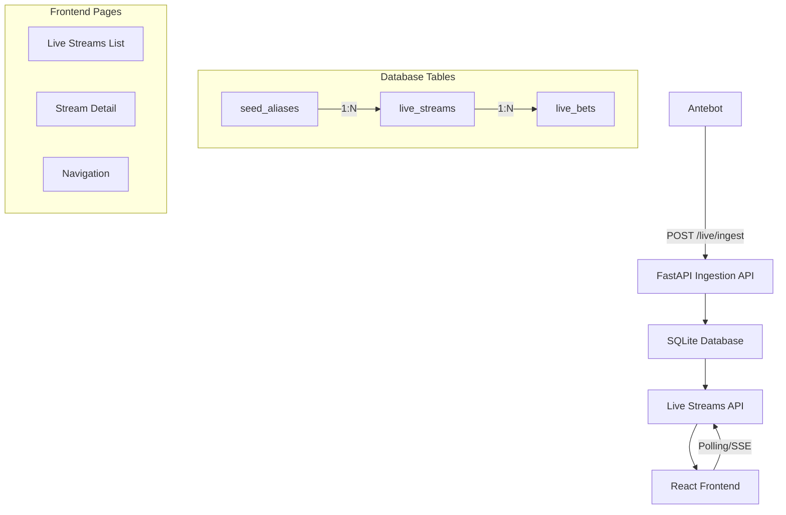

# Live Streams Feature Design

## Overview

The Live Streams feature extends the existing FastAPI + React application to provide real-time ingestion and monitoring of filtered betting data from Antebot. The system automatically groups bets by seed pairs (serverSeedHashed, clientSeed) and provides near-real-time UI updates through polling or Server-Sent Events (SSE).

The design follows the existing application patterns using SQLModel for data models, FastAPI routers for API endpoints, and React with TanStack Query for the frontend, maintaining consistency with the current architecture.

## Architecture

### High-Level Architecture



### Data Flow

1. **Ingestion Flow**: Antebot → FastAPI ingestion endpoint → Database upsert → Response
2. **Display Flow**: React UI → API polling/SSE → Database query → UI update
3. **Stream Management**: Automatic stream creation on new seed pairs, manual stream deletion

## Components and Interfaces

### Backend Components

#### 1. Database Models (`app/models/live_streams.py`)

**LiveStream Model**
- Primary table for grouping bets by seed pairs
- Unique constraint on (server_seed_hashed, client_seed)
- Tracks creation and last activity timestamps

**LiveBet Model**
- Stores individual bet records linked to streams
- Foreign key relationship with cascade delete
- Unique constraint on (stream_id, antebot_bet_id) for idempotency
- Indexed for efficient querying by stream, nonce, timestamp, and multiplier

**SeedAlias Model (Optional)**
- Maps hashed server seeds to plain text versions
- Supports post-rotation verification workflows

#### 2. API Router (`app/routers/live_streams.py`)

**Ingestion Endpoints**
- `POST /live/ingest`: Accept filtered bets from Antebot
- Token-based authentication via X-Ingest-Token header
- Automatic stream creation and bet deduplication

**Query Endpoints**
- `GET /live/streams`: List all streams (limit≤100, offset, default sort last_seen_at DESC)
- `GET /live/streams/{id}`: Stream summary and recent activity
- `GET /live/streams/{id}/bets`: Paginated bet listing (min_multiplier?, limit≤1000, offset, order=nonce_asc|id_desc, default nonce_asc)
- `GET /live/streams/{id}/tail`: Incremental updates (required since_id; returns rows with id > since_id ordered id ASC and last_id echo)
- `GET /live/streams/{id}/events`: Optional Server-Sent Events (events append with {last_id} only; client calls /tail for data)

**Management Endpoints**
- `DELETE /live/streams/{id}`: Remove stream and all bets
- `PUT /live/streams/{id}`: Update stream notes/metadata
- `GET /live/streams/{id}/export.csv`: CSV export functionality

#### 3. Schemas (`app/schemas/live_streams.py`)

**Request/Response Models**
- `IngestBetRequest`: Antebot payload validation
- `StreamSummary`: Stream metadata for list view
- `StreamDetail`: Comprehensive stream information
- `BetRecord`: Individual bet display format
- `TailResponse`: Incremental update payload

### Frontend Components

#### 1. Pages

**LiveStreamsList (`pages/LiveStreamsList.tsx`)**
- Tabular display: seed hash prefix (first 10 chars), client seed, last_seen, total_rows
- "Auto-follow latest" toggle: polls the list, opens most recent stream on change
- Navigation to stream details
- Real-time activity indicators

**LiveStreamDetail (`pages/LiveStreamDetail.tsx`)**
- Stream metadata header with seed information
- Bet table with default order nonce ASC
- Poll `/tail` every 1-2 seconds with since_id parameter
- Export and management actions
- Polling-based live updates (SSE as optional enhancement with polling fallback)

#### 2. Components

**StreamSummaryCard**
- Compact stream information display
- Activity indicators and quick actions

**LiveBetTable**
- Sortable, filterable table of bet records
- Real-time row additions
- Multiplier highlighting and difficulty badges

**StreamActions**
- Export, delete, and note management
- Confirmation dialogs for destructive actions

#### 3. Hooks

**useLiveStreams**
- TanStack Query integration for stream listing
- Real-time refetching and cache management

**useStreamDetail**
- Stream-specific data fetching and updates
- Polling or SSE connection management

**useStreamTail**
- Incremental bet updates using since_id parameter (monotonic id ordering)
- Polling every 1-2 seconds with automatic fallback on SSE failure
- Optimistic UI updates and error handling

## Data Models

### Database Schema

```sql
-- Use ORM defaults for UUIDs. SQL shown as intent, not exact SQLite DDL.
-- Live Streams Table
CREATE TABLE live_streams (
    id TEXT PRIMARY KEY, -- uuid4 string from Python
    server_seed_hashed TEXT NOT NULL,
    client_seed TEXT NOT NULL,
    created_at TEXT NOT NULL,
    last_seen_at TEXT NOT NULL,
    notes TEXT,
    UNIQUE (server_seed_hashed, client_seed)
);

-- Live Bets Table
CREATE TABLE live_bets (
    id INTEGER PRIMARY KEY AUTOINCREMENT,
    stream_id TEXT NOT NULL REFERENCES live_streams(id) ON DELETE CASCADE,
    antebot_bet_id TEXT NOT NULL,
    received_at TEXT NOT NULL,
    date_time TEXT NULL, -- Nullable; fallback to received_at for ordering
    nonce INTEGER NOT NULL CHECK (nonce >= 1),
    amount REAL NOT NULL CHECK (amount >= 0),
    payout_multiplier REAL NOT NULL,
    payout REAL NOT NULL CHECK (payout >= 0),
    difficulty TEXT NOT NULL CHECK (difficulty IN ('easy','medium','hard','expert')),
    round_target REAL NULL, -- (round_target > 0)
    round_result REAL NULL, -- (round_result >= 0)
    UNIQUE (stream_id, antebot_bet_id)
);

-- Seed Aliases Table (Optional)
CREATE TABLE seed_aliases (
    server_seed_hashed TEXT PRIMARY KEY,
    server_seed_plain TEXT NOT NULL,
    first_seen TEXT NOT NULL,
    last_seen TEXT NOT NULL
);

-- Indexes for Performance
CREATE INDEX idx_live_bets_stream_id ON live_bets(stream_id, id); -- For tailing
CREATE INDEX idx_live_bets_stream_nonce ON live_bets(stream_id, nonce);
CREATE INDEX idx_live_bets_stream_mult ON live_bets(stream_id, payout_multiplier DESC);
CREATE INDEX idx_live_streams_last_seen ON live_streams(last_seen_at DESC);
```

**Ordering and Pagination Contract:**
- **Primary display ordering**: `nonce ASC` (chronological bet sequence)
- **Tail pagination**: `id` (monotonic insert order) via `since_id` parameter
- **Idempotency**: Uniqueness enforced by `(stream_id, antebot_bet_id)`

### API Data Contracts

**Ingest Request Format (Flattened)**
```json
{
  "id": "string",
  "dateTime": "2025-09-08T20:31:11.123Z",
  "nonce": 12345,
  "amount": 0.2,
  "payoutMultiplier": 11200.65,
  "payout": 2240.13,
  "difficulty": "expert",
  "roundTarget": 400.02,
  "roundResult": 11200.65,
  "clientSeed": "abcd-123",
  "serverSeedHashed": "1a2b...ff"
}
```

**Ingest Response Format**
```json
// Success - new bet inserted
{
  "streamId": "uuid-string",
  "accepted": true
}

// Success - duplicate bet (idempotent)
{
  "streamId": "uuid-string", 
  "accepted": false
}

// Error - validation failure (422)
{
  "detail": "Validation error message"
}
```

**Ingest Processing Rules:**
- Headers: `X-Ingest-Token` required if configured; reject with 401 if missing/invalid
- DateTime parsing: Convert to UTC; on failure set `date_time = null` and still accept
- Duplicate handling: Return 200 with `accepted: false` for existing `(stream_id, antebot_bet_id)`

**Stream Summary Response**
```json
{
  "id": "uuid",
  "serverSeedHashed": "1a2b...ff",
  "clientSeed": "abcd-123",
  "createdAt": "2025-09-08T20:00:00Z",
  "lastSeenAt": "2025-09-08T20:31:11Z",
  "totalBets": 42,
  "highestMultiplier": 11200.65,
  "notes": "Optional user notes"
}
```

## Error Handling

### API Error Responses

**Authentication Errors**
- 401 Unauthorized: Missing or invalid X-Ingest-Token
- 403 Forbidden: Token valid but insufficient permissions

**Validation Errors**
- 400 Bad Request: Malformed JSON or missing required fields
- 422 Unprocessable Entity: Valid JSON but invalid data values

**Conflict Errors**
- 409 Conflict: Duplicate bet ID within stream (handled idempotently)

**Server Errors**
- 500 Internal Server Error: Database connection or unexpected errors
- 503 Service Unavailable: System maintenance or overload

### Frontend Error Handling

**Network Errors**
- Automatic retry with exponential backoff
- Offline state detection and user notification
- Graceful degradation when API unavailable

**Data Errors**
- Invalid stream ID handling with redirect to streams list
- Missing data fallbacks and skeleton loading states
- User-friendly error messages for all failure scenarios

**Real-time Update Errors**
- SSE connection failure fallback to polling
- Polling failure with manual refresh option
- Stale data indicators when updates fail

## Testing Strategy

### Backend Testing

**Unit Tests**
- Model validation and constraint testing
- API endpoint request/response validation
- Business logic for stream creation and bet grouping
- Error handling and edge cases

**Integration Tests**
- End-to-end ingestion workflow testing
- Database transaction integrity
- Concurrent request handling (two identical ingest requests racing → one accepted, one duplicate)
- Tail semantics with since_id monotonic ordering
- Null date_time handling and idempotent duplicate insert behavior

**Performance Tests**
- Ingestion throughput under load
- Query performance with large datasets
- Memory usage during long-running SSE connections

### Frontend Testing

**Component Tests**
- Individual component rendering and interaction
- Hook behavior and state management
- Error boundary functionality

**Integration Tests**
- Page navigation and routing
- API integration and data flow
- Real-time update mechanisms

**End-to-End Tests**
- Complete user workflows
- Cross-browser compatibility
- Mobile responsiveness

### Security Testing

**Authentication Testing**
- Token validation and rejection scenarios
- Header manipulation attempts
- Rate limiting effectiveness

**Input Validation Testing**
- SQL injection prevention
- XSS protection in user inputs
- Data sanitization verification

**Authorization Testing**
- Endpoint access control
- Stream isolation between users
- Admin function protection

## Implementation Considerations

### Performance Optimizations

**Database Optimizations**
- Strategic indexing for common query patterns
- Connection pooling for concurrent requests
- Query optimization for large datasets

**Frontend Optimizations**
- Virtual scrolling for large bet tables
- Debounced filtering and search
- Efficient re-rendering with React.memo

**Real-time Updates**
- Incremental data fetching with tail pagination using since_id
- SSE or polling with virtualized table rendering
- Client-side caching strategies

### Scalability Considerations

**Horizontal Scaling**
- Stateless API design for load balancing
- Database read replicas for query scaling
- CDN integration for static assets

**Vertical Scaling**
- Memory-efficient data structures
- CPU optimization for real-time processing
- Storage optimization for bet data retention

### Security Measures

**API Security**
- Token-based authentication with X-Ingest-Token header
- Bind API to 127.0.0.1 by default for local-only access
- Input validation and sanitization
- CORS: allow only dev origin (http://localhost:5173)
- Optional INGEST_ALLOWED_ORIGINS or INGEST_ALLOWED_IPS for additional guardrails

**Data Security**
- Encrypted connections (HTTPS/WSS)
- Sensitive data handling best practices
- Audit logging for administrative actions

**Infrastructure Security**
- Local-only deployment configuration
- Network isolation and firewall rules
- Regular security updates and patches
## Addit
ional Implementation Notes

### Update Strategy Clarification
- **Default approach**: Polling with `/tail` endpoint every 1-2 seconds
- **SSE enhancement**: Optional Server-Sent Events with polling fallback
- **No WebSocket**: System uses HTTP-based real-time updates only

### Optional Features (Document as Nice-to-Have)
- "New stream detected" toast notification when fresh (serverSeedHashed, clientSeed) pair appears
- Stream notes/rename functionality for user organization
- CSV export ordered by nonce ASC for chronological analysis

### Data Processing Rules
- **DateTime handling**: Parse to UTC; set `date_time = null` on parse failure, use `received_at` for fallback ordering
- **Missing fields**: Accept bets with null `roundTarget`/`roundResult` values
- **Ordering priority**: Primary display by `nonce ASC`, tail pagination by `id` (monotonic insert order)