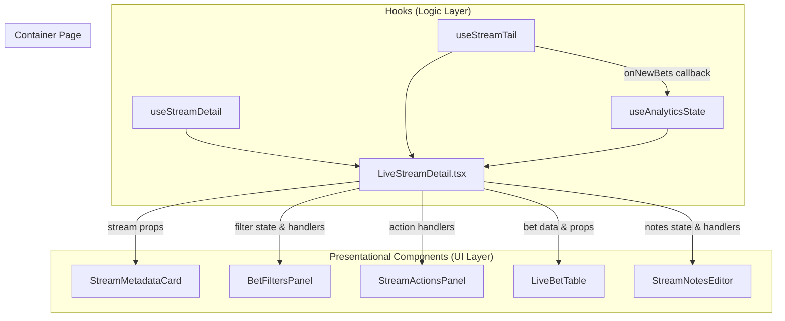
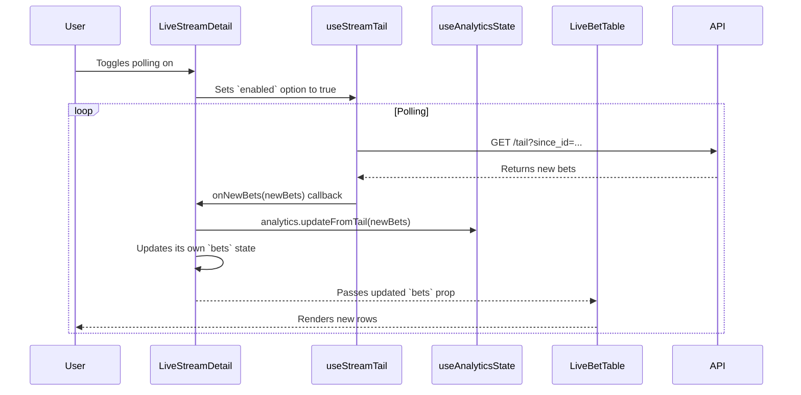

# Technical Design: Refactor LiveStreamDetail.tsx

## Overview
**Purpose**: This feature refactors the `LiveStreamDetail.tsx` page to improve maintainability, modularity, and developer experience.
**Users**: This is a developer-focused refactoring and will not directly change functionality for end-users, but will improve UI consistency and performance.
**Impact**: This refactoring changes the `LiveStreamDetail.tsx` page from a large, monolithic component with scattered state management into a well-structured container component that orchestrates specialized hooks and delegates rendering to smaller, reusable presentational components.

### Goals
-   Replace manual data fetching and polling logic with the existing `useStreamTail` and `useAnalyticsState` hooks.
-   Replace the legacy `Table` with the more feature-rich `LiveBetTable` component.
-   Decompose the UI into smaller, single-responsibility components like `StreamMetadataCard` and `BetFiltersPanel`.
-   Establish a clear, one-way data flow from hooks to the container page to child components.

### Non-Goals
-   Introduce new user-facing features.
-   Change the backend API.
-   Alter the core business logic within the existing hooks.

## Architecture

### Existing Architecture Analysis
The current implementation of `LiveStreamDetail.tsx` is a monolithic component that handles multiple responsibilities:
-   **State Management**: Numerous `useState` and `useEffect` hooks are used to manage local UI state, fetched data, and polling logic directly within the component.
-   **Data Fetching**: It contains manual `fetch` logic inside a `useEffect` for polling real-time updates, which is complex and tightly coupled to the component's lifecycle.
-   **Rendering**: It renders a large, complex JSX tree containing metadata, filters, actions, and a custom table implementation, all within a single file.
This leads to poor separation of concerns, making the component difficult to test, maintain, and extend.

### High-Level Architecture
The refactored architecture will adopt a "Container/Presentational" pattern, where `LiveStreamDetail.tsx` acts as the container.



**Architecture Integration**:
-   **Existing patterns preserved**: The use of custom hooks for abstracting business logic and data fetching is reinforced and properly utilized. The page-based routing structure remains unchanged.
-   **New components rationale**: New presentational components are introduced to encapsulate specific parts of the UI, improving reusability and making the code easier to read and test. Each component will have a single, well-defined responsibility.
-   **Technology alignment**: This approach aligns perfectly with the project's React and TypeScript stack, promoting best practices for component-based architecture.
-   **Steering compliance**: The design adheres to the `frontend-patterns` guidelines by promoting composition, clear prop interfaces, and separation of concerns.

### Key Design Decisions

-   **Decision**: Adopt a "Composition over Centralization" strategy for hooks.
-   **Context**: The initial idea was to create a single `useStreamDetailState` hook to wrap all other hooks. However, this would create a new monolithic "god hook", merely shifting complexity rather than resolving it.
-   **Alternatives**:
    1.  **Monolithic Hook**: Create a single `useStreamDetailState` that encapsulates all logic. This was rejected as it would be difficult to maintain and test.
    2.  **Keep As-Is**: Leave the logic inside the component. This was rejected as it's the source of the current maintainability issues.
-   **Selected Approach**: Compose the existing, specialized hooks (`useStreamTail`, `useAnalyticsState`, `useStreamDetail`) directly within the `LiveStreamDetail` component. This leverages existing, well-tested code and creates a clear data pipeline.
-   **Rationale**: This approach provides the best separation of concerns. Each hook handles a specific aspect of the logic (data fetching, real-time updates, analytics), and the page component is responsible for orchestrating them and passing data to the UI.
-   **Trade-offs**: This results in slightly more hook instantiations within the component file itself, but this is a minor readability trade-off for a major gain in modularity and maintainability.

## System Flows

### Real-time Data Flow

This diagram illustrates how new bet data flows through the system, from the API to the UI components.



## Components and Interfaces

### Pages

#### `pages/LiveStreamDetail.tsx` (Refactored)

**Responsibility & Boundaries**
-   **Primary Responsibility**: Orchestrate data-fetching and state-management hooks, manage UI-specific state (like filter values), and compose the UI by passing data down to presentational child components.
-   **Domain Boundary**: Belongs to the `live-streams` feature.
-   **Data Ownership**: Owns the local UI state for filters and notes. It receives server state from the hooks it consumes.

**Dependencies**
-   **Inbound**: React Router.
-   **Outbound**: `useStreamDetail`, `useStreamTail`, `useAnalyticsState`, `StreamMetadataCard`, `BetFiltersPanel`, `StreamActionsPanel`, `LiveBetTable`, `StreamNotesEditor`.

### New Components

#### `components/live-streams/StreamMetadataCard.tsx`

**Responsibility & Boundaries**
-   **Primary Responsibility**: Display the stream's metadata, including seeds, statistics, and status.
-   **Contract Definition**:
    ```typescript
    interface StreamMetadataCardProps {
      streamDetail: StreamDetail;
      isPolling: boolean;
      highFrequencyMode: boolean;
      onTogglePolling: () => void;
      onToggleFrequency: () => void;
    }
    ```

#### `components/live-streams/BetFiltersPanel.tsx`

**Responsibility & Boundaries**
-   **Primary Responsibility**: Display filter controls and report changes back to the parent component.
-   **Contract Definition**:
    ```typescript
    interface BetFiltersPanelProps {
      filters: {
        minMultiplier?: number;
        orderBy: 'nonce_asc' | 'id_desc';
      };
      onFilterChange: (filters: Partial<BetFiltersPanelProps['filters']>) => void;
      onClearFilters: () => void;
      totalBets: number;
      filteredBets: number;
    }
    ```

#### `components/live-streams/StreamActionsPanel.tsx`

**Responsibility & Boundaries**
-   **Primary Responsibility**: Display action buttons for the stream (e.g., Export CSV, Delete).
-   **Contract Definition**:
    ```typescript
    interface StreamActionsPanelProps {
      onExportCsv: () => void;
      onDeleteStream: () => void;
      isDeleting: boolean;
    }
    ```

#### `components/live-streams/StreamNotesEditor.tsx`

**Responsibility & Boundaries**
-   **Primary Responsibility**: Display and manage editing of the stream's notes.
-   **Contract Definition**:
    ```typescript
    interface StreamNotesEditorProps {
      initialNotes: string;
      onSave: (notes: string) => void;
      isSaving: boolean;
    }
    ```

### Modified Components

#### `components/LiveBetTable.tsx`

**Responsibility & Boundaries**
-   **Primary Responsibility**: To display, sort, and filter a list of bet records. It will now be used within `LiveStreamDetail`.
-   **Integration Strategy**: The existing component will be used as-is. The `LiveStreamDetail` page will provide the necessary props (`bets`, `isLoading`, filter/sort handlers) to integrate it.

## Error Handling

### Error Strategy
The primary error handling strategy relies on the robust error states provided by TanStack Query through the custom hooks (`useStreamDetail`, `useStreamTail`).

### Error Categories and Responses
-   **Data Fetching Errors**: If `useStreamDetail` or the initial fetch from `useEnhancedStreamBets` fails, the component will render a full-page error state with a "Retry" button.
-   **Polling Errors**: `useStreamTail` has built-in resilience. It will log polling errors to the console and can show a subtle indicator to the user (e.g., a toast notification via `onError` callback) without halting the entire UI. If polling fails repeatedly, it will stop and display a persistent error message.
-   **UI Errors**: The `LiveStreamDetail` page will be wrapped in a React Error Boundary (`LiveStreamsErrorBoundary`) to catch any unexpected rendering errors.

## Testing Strategy

### Unit Tests
-   **`StreamMetadataCard`**: Test that it correctly renders all data from the `streamDetail` prop.
-   **`BetFiltersPanel`**: Test that input changes call the `onFilterChange` callback with the correct values.
-   **`StreamActionsPanel`**: Test that clicking buttons calls the corresponding action handlers.
-   **`StreamNotesEditor`**: Test the component's state transition between viewing and editing modes.

### Integration Tests
-   **`LiveStreamDetail.tsx`**:
    -   Use `testing-library/react` to render the component with mocked hooks.
    -   Verify that data from the mocked `useStreamDetail` hook is correctly passed to `StreamMetadataCard`.
    -   Simulate new bets from the mocked `useStreamTail` hook and assert that the `bets` prop passed to `LiveBetTable` is updated.
    -   Simulate user interaction with `BetFiltersPanel` and verify that the local state for filters is updated correctly.

### E2E Tests
-   Existing Playwright or Cypress tests for the live stream detail page should be reviewed and updated to account for the new component structure.
-   A test case should verify that when new bets are ingested, they appear in the `LiveBetTable` without requiring a full page reload.
